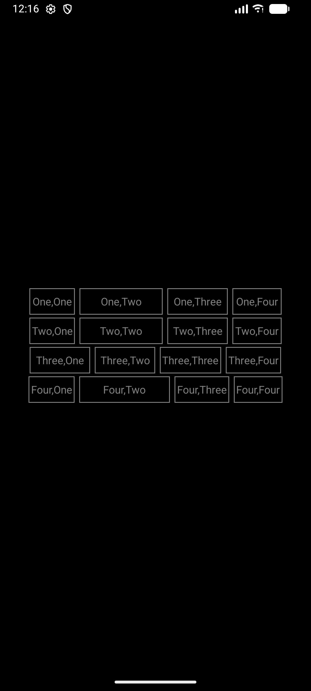
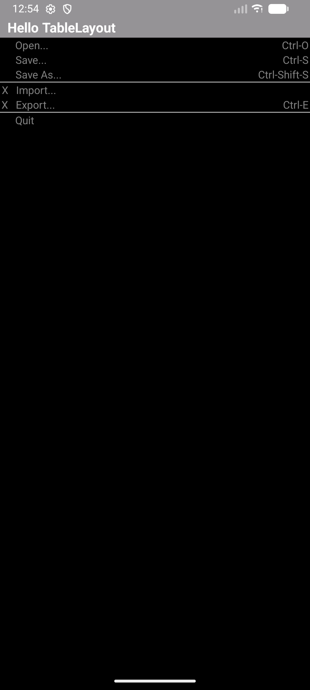
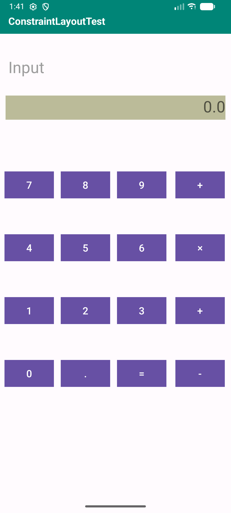
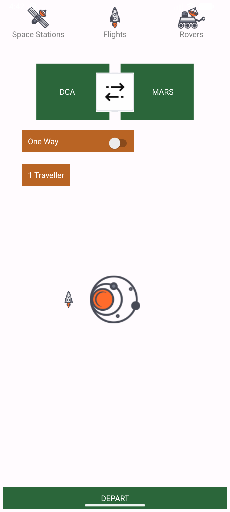

# 实验二、Android界面布局

[返回目录](../README.md)

首先是初始化界面，添加几个按钮跳转到不同的界面布局示例

**初始化界面**

**线性布局展示**

这里线性布局采用嵌套线性布局的方式进行，以一个垂直线性布局嵌套四个水平线性布局。

**表格布局展示**

注意使用gravity以及layout_alignParentRight等属性来控制控件在界面中的显示。

**约束布局1（计算器）展示**

**约束布局2（带图片资源）展示**

