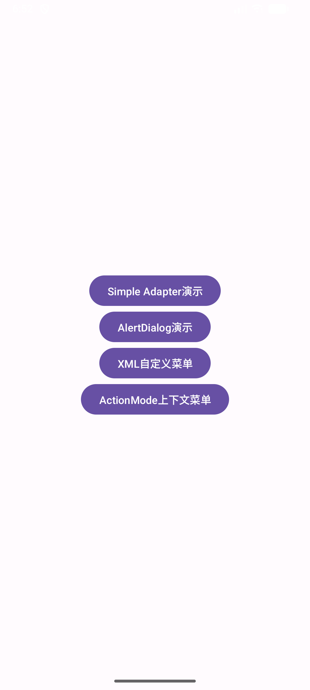
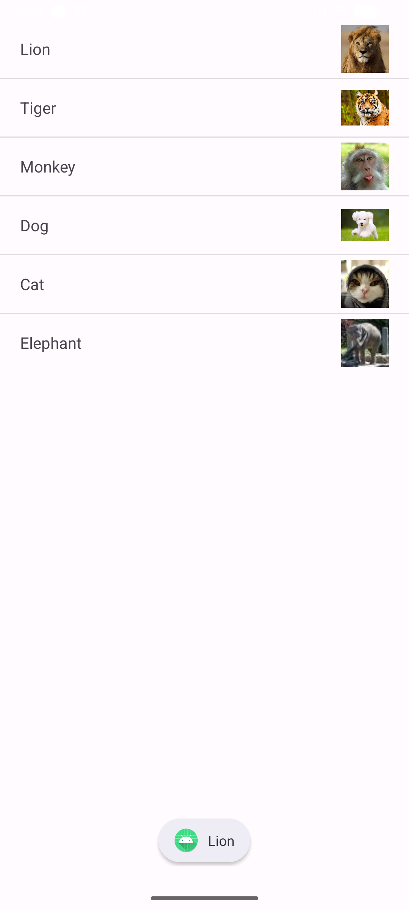
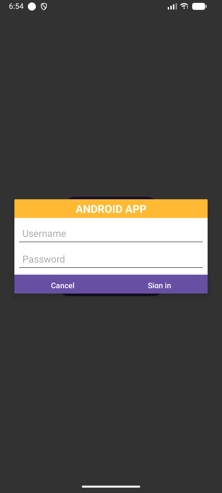
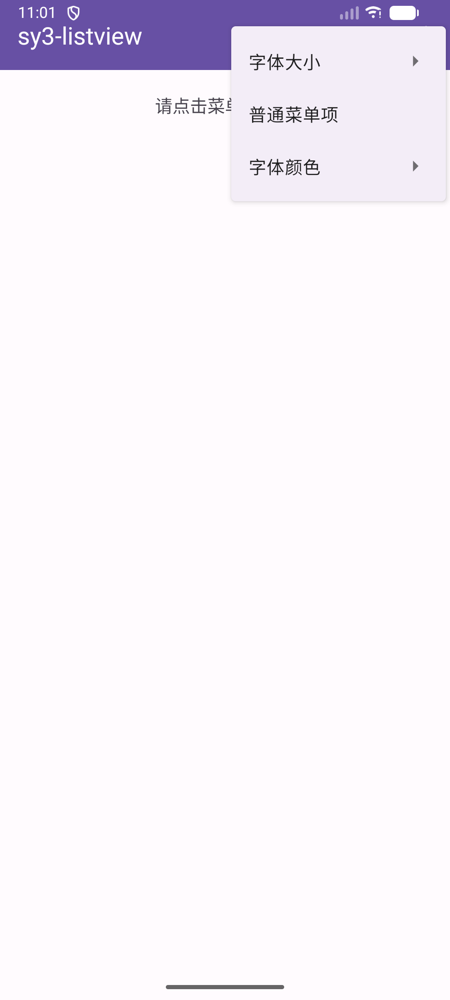
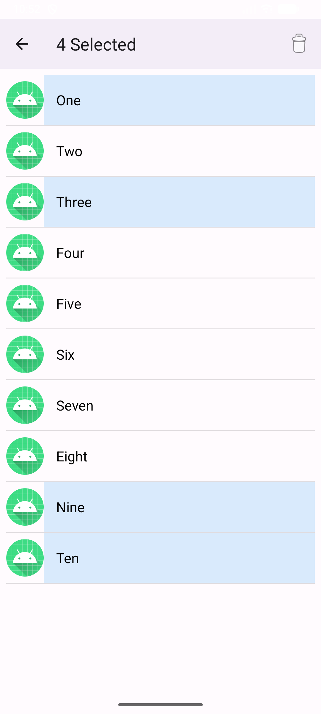
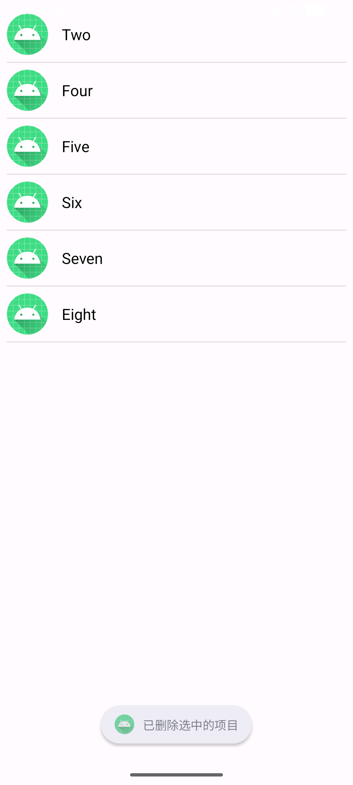

# 实验三、Android界面组件

[返回目录](../README.md)

## 主界面

主界面，提供四个按钮，分别跳转到对应的布局页面、弹框

## Simple Adapter - ListView

图示为点击Lion项的效果

## AlertDialog

点击AlertDialog演示 按钮，弹出对话框

## XML自定义菜单

### 一级菜单项

### 二级菜单项

字体大小

字体颜色

### 设置效果（图示为字号“大”，字色红色）

## ActionMode上下文菜单

选中效果

删除后

